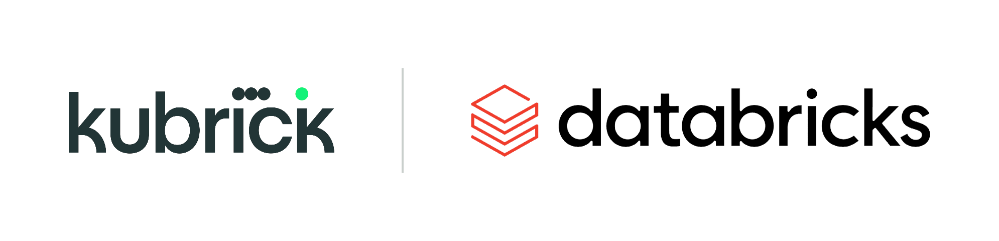

  
  &nbsp;&nbsp;&nbsp;&nbsp;
  

# earl-databricks-workshop-ai-functions

Materials for a Databricks AI Functions workshop: sample datasets and a set of hands-on SQL
notebooks covering `ai_classify`, `ai_extract`, `ai_summarize`, `ai_parse_document`, and wiring
one of those queries up to a Job.

Reference: [Databricks AI Functions documentation](https://docs.databricks.com/aws/en/large-language-models/ai-functions)

## Get a workspace

You need a Databricks workspace to run these notebooks. If you don't already have one, sign up
for [Databricks Free Edition](https://login.databricks.com/?dbx_source=docs&intent=CE_SIGN_UP) —
it's free, self-serve, and gives you your own workspace immediately with no invite needed (one
workspace per account).

## Naming convention

Every notebook's widgets default to catalog **`main`**, schema **`workshop`**. Use those and you
won't need to edit anything — just run the notebooks as-is.

## Notebooks

Run in order:

1. **`01_ingest_data.sql`** — loads the complaints dataset into a table
2. **`02_ai_functions.sql`** — `ai_classify` / `ai_extract` / `ai_summarize`, plus a chaining example
3. **`03_document_exploration.sql`** — `ai_parse_document` + `ai_extract` on invoice PDFs
4. **`04_pipelines_jobs.sql`** *(optional)* — automates one of the AI function queries via a
   Databricks Job; try this in your own time if the session runs out

After the notebooks, there's a UI-only activity (no notebook): see **[GENIE_GUIDE.md](GENIE_GUIDE.md)**
to build a Genie space over `main.workshop.complaints` and ask it questions in plain English.

## Datasets

- [`complaints_sample.csv`](complaints_sample.csv) — 831 consumer complaint records with narratives, stratified across 11 CFPB product categories
- [`invoices_workshop.zip`](invoices_workshop.zip) — 25 single-page invoice PDFs for document-parsing exercises

## Running a notebook

**Recommended — clone the whole repo via Git folders:** in your workspace sidebar, **Workspace →
Add → Add a Git folder**, paste `https://github.com/alcole/earl-databricks-workshop-ai-functions`,
and clone. All four notebooks and both datasets land in your workspace at once, and you can
**Pull** later to grab any updates — no need to download or import anything by hand.

Or, to grab just one notebook:
- **Import it**: download the `.sql` file from this repo, then in your workspace **Workspace →
  Import**, upload it (format: `Source`)
- **Copy-paste**: open a new notebook and paste the cells in directly

## Data sources & attribution

**Complaints data** — derived from [US Consumer Finance Complaints](https://www.kaggle.com/datasets/kaggle/us-consumer-finance-complaints) (Kaggle, published by the `kaggle` organization account). Originally sourced from the [CFPB Consumer Complaint Database](https://www.consumerfinance.gov/data-research/consumer-complaints/). License listed on the Kaggle dataset page: Unknown.

**Invoice images** — derived from [High-Quality Invoice Images for OCR](https://www.kaggle.com/datasets/osamahosamabdellatif/high-quality-invoice-images-for-ocr) by osama hosam Abdellatif (Kaggle). License: [Open Database License (ODC-DbCL) v1.0](http://opendatacommons.org/licenses/dbcl/1.0/).

If you reuse or redistribute this data, credit the original dataset authors/pages above.
