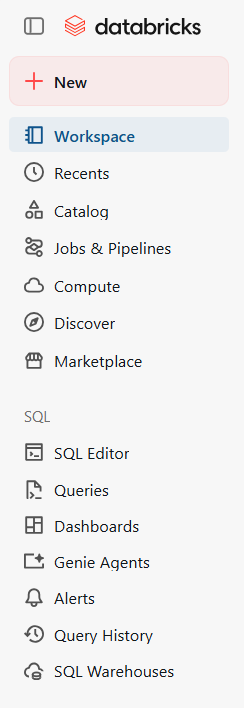
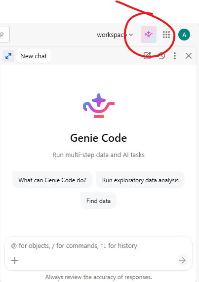
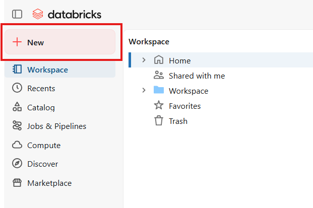
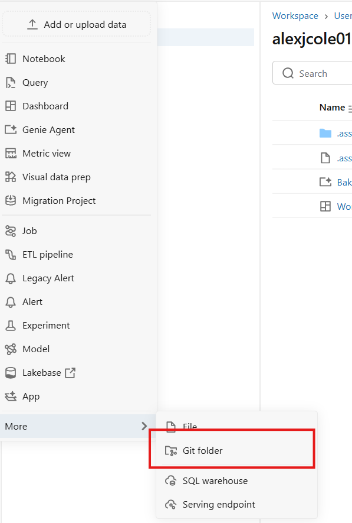
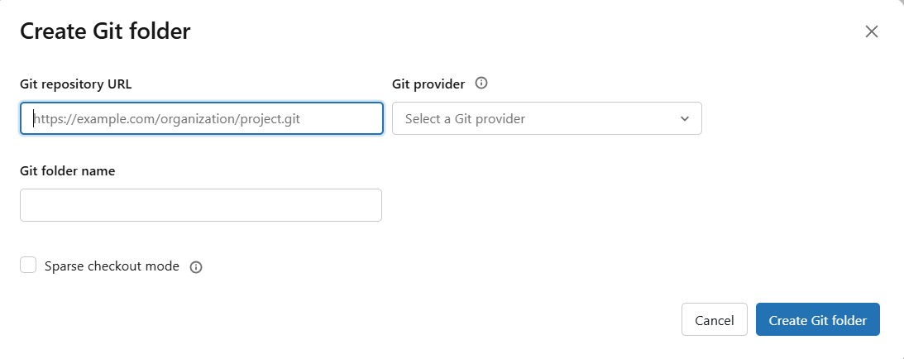
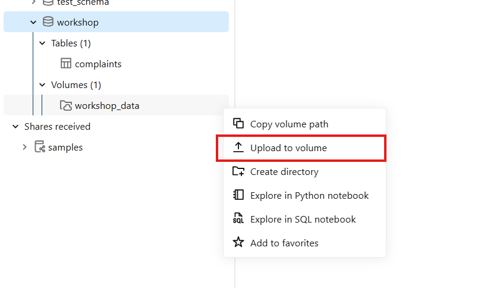

<!-- _class: lead -->
<!-- _paginate: false -->

<div class="logo-row">
  
  
</div>

# Databricks AI Functions Workshop

EARL Conference 2026 · Kubrick Group × Databricks

---

<!-- _class: brand-footer -->

## Today's agenda

| Time | Block | Mode |
|---|---|---|
| 9:00–9:25 | Intro & workspace orientation | Talk, Hands-on |
| 9:25–9:40 | API → governed table (demo) | Demo |
| 9:40–10:30 | SQL AI functions (core) | Talk, Hands-on |
| 10:30–10:45 | Break | |
| 10:45–11:20 | Automation / document exploration | Hands-on, Demo |
| 11:20–11:45 | Genie + dashboard | Demo, light hands-on |
| 11:45–12:00 | Cost economics, Q&A | Talk |

<!-- Speaker notes — talk through the goals as you walk the agenda, no separate slide needed:
- Load real-world data into a governed Unity Catalog table
- Call AI functions directly from SQL — classify, extract, summarize, parse documents
- Chain AI functions together into pipelines
- Automate a query via a Databricks Job
- Ask questions of your data in plain English with Genie
- Talk through what this actually costs in production
-->

---

<!-- _class: brand-footer -->

## Who we are

Kubrick Group

<div class="people-row">
  <div class="person">
    
    <div class="person-name">Alex Cole</div>
    <div class="person-title">Principal Architect, Databricks MVP</div>
    <div class="person-title"><a href="https://www.linkedin.com/in/alexcole01">LinkedIn</a></div>
  </div>
  <div class="person">
    
    <div class="person-name">Ian Payne</div>
    <div class="person-title">Databricks Capability Lead</div>
  </div>
  <div class="person">
    
    <div class="person-name">Andres Baravalle</div>
    <div class="person-title">Senior Data Engineering Manager</div>
    <div class="person-title"><a href="https://www.linkedin.com/in/baravalle/">LinkedIn</a></div>
  </div>
</div>

<p class="shoutout">Catch Andres on 8th October (day 2): <strong><a href="https://earl-conference.com/speakers/Andres-Baravalle/">"Is Someone Poisoning Your Data?"</a></strong> — 11:00am</p>

---

<!-- _class: divider -->

<div class="eyebrow">9:00 – 9:25</div>

## Intro & workspace orientation

<div class="mode-tag">Talk · Hands-on</div>

---

<!-- _class: brand-footer -->

## Get signed in

Go to:

<p class="url-callout"><a href="https://login.databricks.com">login.databricks.com</a></p>

- Already have a workspace? Sign in.
- Don't have one? **Sign up** from the same page — free, self-serve, your own
  workspace immediately, no admin provisioning or invite needed

---

<!-- _class: brand-footer -->

## Workspace tour

<div class="columns columns-skewed">
<div>



</div>
<div>

- **Workspace** — your way to the notebooks; today's materials land here once we import the Git folder (shortly)
- **Catalog Explorer** — browse catalogs, schemas, tables, volumes
- **SQL editor** — run ad-hoc queries, save them for later (we'll need this in block 4)

</div>
</div>

---

<!-- _class: brand-footer -->

## Where you work

Three layers, stacked:

- **Databricks Workspace** — Catalog Explorer, SQL Editor, Notebooks: where you spend today
- **Unity Catalog** — governs what you can see, and makes it discoverable
- **Lakehouse storage** — your data at rest, in open formats, in your own cloud account

You work in the Workspace; Unity Catalog decides what shows up there.

---

<!-- _class: brand-footer -->

## Four objects you'll meet

- **Tables** — rows and columns, the workhorse for analysis (today: `complaints`)
- **Views** — a saved query over one or more tables, always up to date
- **Volumes** — governed storage for files that aren't tabular yet (today: CSVs, invoice PDFs)
- **Functions** — saved, reusable logic — including the AI functions we'll use all day

---

<!-- _class: brand-footer -->

## Three ways to discover data

- **Catalog Explorer** — browse by eye: catalog → schema → table/volume
- **Search** — find objects by name or description across the workspace
- **Query it directly** — `SHOW TABLES IN main.workshop` works from any notebook cell or the SQL editor

We'll use all three today.

---

<!-- _class: brand-footer -->

## Naming convention

Every table on Databricks has a three-part address — catalog, then schema, then table:

```
   main    .  workshop  .  complaints
  catalog     schema       table
```

Today's notebook widgets default to the first two parts, so every notebook runs as-is:

```
catalog = main
schema  = workshop
```

Use those defaults — no editing required. Just **Run All**.

---

<!-- _class: brand-footer -->

## Before we start: meet Genie Code

<div class="columns">
<div>



</div>
<div>

Stuck on an exercise today? **Genie Code** is Databricks' built-in AI coding assistant —
available right inside notebooks and the SQL editor.

- Click the Genie icon in the top-right corner of any page to open the chat pane
- Ask it to explain an error, fix a query, or describe what a cell does
- Governed by the same Unity Catalog permissions as everything else — it only sees what you can see

Not required today, but there if you want it.

</div>
</div>

<!-- Speaker note: disambiguate from Genie Agents (Block 5) if asked — Genie Code is the
dev-assistant for notebooks/SQL editor; Genie Agents is the natural-language Q&A space we
build over the complaints table later. Same "Genie" branding, different products. -->

---

<!-- _class: brand-footer -->

## Import today's materials

<div class="screenshot-strip">
  <figure>
    
    <figcaption>1. + New</figcaption>
  </figure>
  <figure>
    
    <figcaption>2. More → Git folder</figcaption>
  </figure>
  <figure>
    
    <figcaption>3. Paste the URL</figcaption>
  </figure>
</div>

<p class="url-callout"><a href="https://github.com/alcole/earl-databricks-workshop-ai-functions">github.com/alcole/earl-databricks-workshop-ai-functions</a></p>

- All of today's notebooks and datasets land in your workspace at once
- **Pull** later to grab any updates — no re-downloading or re-importing by hand

---

<!-- _class: brand-footer -->

## Load today's data — do this now

Open **`01_ingest_data.sql`** and **Run All**.

- Creates the `main.workshop` schema + volume (names from the convention above)
- Data ships in the repo you just pulled — nothing to upload
- Loads 831 sample complaints into `main.workshop.complaints`
- Takes under a minute — a stopped warehouse adds a few seconds to the first query

<!-- Speaker note: kick this off here, then keep talking through Block 2's governed-table
demo while it finishes in the background — by Block 3 everyone's table is ready and we
go straight into the AI functions activity with no pause to ingest. -->

---

<!-- _class: brand-footer -->

## Two ways data lands here



- **Data engineers build pipelines** — connect to a source database, watch cloud storage for new files, or integrate directly with an API
- **Data analysts upload directly** — drop a file into a Unity Catalog **Volume**, like we just did with `complaints_sample.csv`

---

<!-- _class: divider -->

<div class="eyebrow">9:25 – 9:40</div>

## API → governed table

<div class="mode-tag">Demo</div>

<!-- TODO: flesh out from slide-content-list.md once agreed — currently only has one bullet logged ("what a governed table / UC model gives you vs. raw ingestion") -->

---

<!-- _class: divider -->

<div class="eyebrow">9:40 – 10:30</div>

## SQL AI functions

<div class="mode-tag">Talk · Hands-on · Core</div>

---

<!-- _class: brand-footer -->

## A foundation model, called from SQL

```sql
SELECT ai_<function>(column, ...) FROM my_table;
```

- No endpoint to stand up, no client library — just SQL
- Runs row by row over a text column
- Three functions today: **`ai_classify`**, **`ai_extract`**, **`ai_summarize`**
- Hands-on companion: `02_ai_functions.sql`, against the `complaints` table from Block 2

---

<!-- _class: brand-footer -->

## Three functions, three jobs

| Function | What it does |
|---|---|
| **`ai_classify`** | Sorts free text into one of a fixed list of labels you provide |
| **`ai_extract`** | Pulls named fields out of free text into a struct |
| **`ai_summarize`** | Condenses free text to a shorter summary, optionally word-capped |

One line of SQL each — the next few slides show them against real complaint narratives.

---

<!-- _class: brand-footer -->

## `ai_classify` — sort text into fixed labels

Good for routing, tagging, turning unstructured text into a groupable column.

```sql
SELECT
  complaint_id,
  product,
  ai_classify(
    narrative,
    ARRAY(
      'Billing or fee dispute',
      'Debt collection practices',
      'Fraud or unauthorized transaction',
      'Credit reporting error',
      'Customer service quality',
      'Other'
    )
  ) AS category
FROM complaints
LIMIT 15;
```

<!-- Speaker note: categories were picked by skimming the actual narratives in this sample, not generic placeholders. -->

---

<!-- _class: brand-footer -->

## `ai_extract` — pull structured fields out of free text

Returns a struct with one key per field you ask for; a field not present in the text comes back `null` rather than erroring.

```sql
SELECT
  complaint_id,
  ai_extract(
    narrative,
    ARRAY('company name mentioned', 'dollar amount mentioned', 'date mentioned')
  ) AS extracted_fields
FROM complaints
LIMIT 15;
```

---

<!-- _class: brand-footer -->

## `ai_summarize` — condense text to a target length

```sql
SELECT
  complaint_id,
  product,
  ai_summarize(narrative, 40) AS narrative_summary
FROM complaints
LIMIT 15;
```

- Optional second argument caps the summary length in words
- Useful when the summary needs to fit a column — or feed into a downstream step (next)

---

<!-- _class: brand-footer -->

## Chaining: summarize, then classify the summary

Feed the **output** of one AI function into another as input — here, urgency is
classified from the *summary*, not the original narrative.

```sql
WITH summarized AS (
  SELECT complaint_id, product,
    ai_summarize(narrative, 40) AS narrative_summary
  FROM complaints
  LIMIT 15
)
SELECT complaint_id, product, narrative_summary,
  ai_classify(narrative_summary, ARRAY('High', 'Medium', 'Low')) AS urgency
FROM summarized;
```

Reasoning over a few words is cheaper and faster than re-running against the full text for every downstream question.

---

<!-- _class: brand-footer -->

## Things to know

- Output comes from an LLM — **non-deterministic**: re-running can shift edge cases
- Cost and latency scale with **row count × text length**, not a flat per-query price
  (numbers in the Cost economics block)
- You provide the labels / field names — no auto-discovery
- Works against a `STRING` column — cast or parse first if your text is nested elsewhere

---

<!-- _class: divider -->

<div class="eyebrow">10:45 – 11:20</div>

## Automation & document exploration

<div class="mode-tag">Hands-on · Demo</div>

<!-- TODO: pipelines/jobs one-slide mention, ai_parse_document pipeline, variant_explode, ai_extract signature gotcha, ai_prep_search -->

---

<!-- _class: divider -->

<div class="eyebrow">11:20 – 11:45</div>

## Genie + dashboard

<div class="mode-tag">Demo · Light hands-on</div>

---

<!-- _class: brand-footer -->

## Ask your data questions in plain English

Genie is a click-through, no-SQL way to query a table — point it at data once, then just type questions.

- No notebook for this one — everything happens in the Databricks UI
- Needs `main.workshop.complaints` to exist, so **`01_ingest_data.sql`** must have run first
- Under the hood it's still writing and running SQL — Genie shows you the query it used

---

<!-- _class: brand-footer -->

## Create your Genie space

1. Sidebar: **New** → **Genie space**
2. Title it, e.g. `Complaints Explorer`
3. **Add tables** → browse to `main` → `workshop` → `complaints` → add it
4. Pick the SQL warehouse you've used all day
5. **Create** — a chat panel opens

<!-- TODO: screenshot — Genie space creation / chat panel -->

---

<!-- _class: brand-footer -->

## Try it yourself

Four questions, verified against a real space — not hypothetical:

1. **"How many complaints are in this table?"** — sanity check. Answer: **831**
2. **"Which company received the most complaints, and how many?"** — Answer: **Experian, 55**
3. **"Which state has the most billing dispute complaints?"** — Genie has to recognize
   "billing dispute(s)" as a real `issue` value, then group and rank by state. Answer: **NY, 4**
4. **"Break down complaint counts by product for California only, highest first"** — filter +
   aggregate across two columns; usually renders a chart. Answer: **Mortgage (37), Debt
   collection (25), Credit reporting (16)...**

---

<!-- _class: brand-footer -->

## If you get stuck

- **Empty or generic answer** — double-check you added `main.workshop.complaints`, not a
  different catalog/schema
- **A question about "categories" comes back empty** — there's no pre-computed category
  column; ask about `product` or `issue` instead, or run `02_ai_functions.sql`'s classify
  query first
- None of today's questions need a SQL `JOIN` — this space only has the one table

---

<!-- _class: brand-footer -->

## The presenter's dashboard

<!-- TODO: screenshot — published dashboard -->

A Lakeview/AI-BI dashboard built the same way you'd build one over any governed table:

- **3 KPI counters** — total complaints, distinct companies, distinct states
- **Monthly trend** — complaints received per month
- **By product** — which categories complain most
- **Top 10 companies** — by complaint count

Built directly against `main.workshop.complaints` — no new notebook, no new pipeline.

---

<!-- _class: divider -->

<div class="eyebrow">11:45 – 12:00</div>

## Cost economics & Q&A

<div class="mode-tag">Talk</div>

<!-- TODO: AI Parse Document / AI Extract / AI Classify / ai_summarize pricing from slide-content-list.md -->

---

<!-- _class: lead -->
<!-- _paginate: false -->

<div class="logo-row">
  
  
</div>

# Thank you

Repo: github.com/alcole/earl-databricks-workshop-ai-functions
