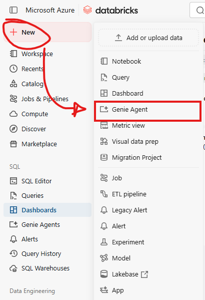

<!-- _class: lead -->
<!-- _paginate: false -->

<div class="logo-row">
  
  
</div>

# Databricks AI Functions Workshop

EARL Conference 2026 · Kubrick Group × Databricks

---

<!-- _class: brand-footer -->

## Today's agenda

| Time | Block | Mode |
|---|---|---|
| 9:00–9:25 | Intro & workspace orientation | Talk, Hands-on |
| 9:25–9:40 | API → governed table (demo) | Demo |
| 9:40–10:30 | SQL AI functions (core) | Talk, Hands-on |
| 10:30–10:45 | Break | |
| 10:45–11:20 | Automation / document exploration | Hands-on, Demo |
| 11:20–11:45 | Genie Agent + AI/BI dashboard | Demo, light hands-on |
| 11:45–12:00 | Cost economics, Q&A | Talk |

<!-- Speaker notes — talk through the goals as you walk the agenda, no separate slide needed:
- Load real-world data into a governed Unity Catalog table
- Call AI functions directly from SQL — classify, extract, summarize, parse documents
- Chain AI functions together into pipelines
- Automate a query via a Databricks Job
- Ask questions of your data in plain English with Genie
- Talk through what this actually costs in production
-->

---

<!-- _class: brand-footer -->

## Who we are

Kubrick Group

<div class="people-row">
  <div class="person">
    
    <div class="person-name">Alex Cole</div>
    <div class="person-title">Principal Architect, Databricks MVP</div>
    <div class="person-title"><a href="https://www.linkedin.com/in/alexcole01">/in/alexcole01</a></div>
  </div>
  <div class="person">
    
    <div class="person-name">Ian Payne</div>
    <div class="person-title">Databricks Capability Lead</div>
  </div>
  <div class="person">
    
    <div class="person-name">Andres Baravalle</div>
    <div class="person-title">Senior Data Engineering Manager</div>
    <div class="person-title"><a href="https://www.linkedin.com/in/baravalle/">/in/baravalle</a></div>
  </div>
</div>

<p class="shoutout">Catch Andres on 8th October (day 2): <strong><a href="https://earl-conference.com/speakers/Andres-Baravalle/">"Is Someone Poisoning Your Data?"</a></strong> — 11:00am</p>

---

<!-- _class: divider -->

<div class="eyebrow">9:00 – 9:25</div>

## Intro & workspace orientation

<div class="mode-tag">Talk · Hands-on</div>

---

<!-- _class: brand-footer -->

## Get signed in

Go to:

<p class="url-callout"><a href="https://login.databricks.com">login.databricks.com</a></p>

- Already have a workspace? Sign in.
- Don't have one? **Sign up** from the same page — free, self-serve, your own
  workspace immediately, no admin provisioning or invite needed

---

<!-- _class: brand-footer -->

## Workspace tour

<div class="columns columns-skewed">
<div>


</div>
<div>

- **Workspace** — your way to the notebooks; today's materials land here once we import the Git folder (shortly)
- **Catalog Explorer** — browse catalogs, schemas, tables, volumes
- **SQL editor** — run ad-hoc queries, save them for later (we'll need this in block 4)

</div>
</div>

---

<!-- _class: brand-footer -->

## Where you work

Three layers, stacked:

- **Databricks Workspace** — Catalog Explorer, SQL Editor, Notebooks: where you spend today
- **Unity Catalog** — governs what you can see, and makes it discoverable
- **Lakehouse storage** — your data at rest, in open formats, in your own cloud account

You work in the Workspace; Unity Catalog decides what shows up there.

---

<!-- _class: brand-footer -->

## Four objects you'll meet

<div class="arch-stack">
  <div class="arch-row neutral">Catalog — <code>main</code></div>
  <div class="arch-arrow">↓</div>
  <div class="arch-row neutral">Schema — <code>workshop</code></div>
  <div class="arch-arrow">↓</div>
  <div class="arch-options">
    <div class="arch-option used">Table<br>rows &amp; columns — <code>complaints</code></div>
    <div class="arch-option unused">View<br>saved query — not used today</div>
    <div class="arch-option used">Volume<br>files — CSVs, invoice PDFs</div>
    <div class="arch-option used">Function<br>reusable logic — the AI functions</div>
  </div>
</div>

Highlighted: the three object types we'll actually touch today.

---

<!-- _class: brand-footer -->

## Three ways to discover data

- **Catalog Explorer** — browse by eye: catalog → schema → table/volume
- **Search** — find objects by name or description across the workspace
- **Query it directly** — `SHOW TABLES IN main.workshop` works from any notebook cell or the SQL editor

We'll use all three today.

---

<!-- _class: brand-footer -->

## Naming convention

Every table on Databricks has a three-part address — catalog, then schema, then table:

<div class="ns-chain">
  <div class="ns-box">
    <div class="ns-value">main</div>
    <div class="ns-label">catalog</div>
  </div>
  <div class="ns-sep">.</div>
  <div class="ns-box">
    <div class="ns-value">workshop</div>
    <div class="ns-label">schema</div>
  </div>
  <div class="ns-sep">.</div>
  <div class="ns-box">
    <div class="ns-value">complaints</div>
    <div class="ns-label">table</div>
  </div>
</div>

Today's notebook widgets default to the first two parts, so every notebook runs as-is:

```
catalog = main
schema  = workshop
```

Use those defaults — no editing required. Just **Run All**.

---

<!-- _class: brand-footer -->

## Before we start: meet Genie Code

<div class="columns">
<div>


</div>
<div>

Stuck on an exercise today? **Genie Code** is Databricks' built-in AI coding assistant —
available right inside notebooks and the SQL editor.

- Click the Genie icon in the top-right corner of any page to open the chat pane
- Ask it to explain an error, fix a query, or describe what a cell does
- Governed by the same Unity Catalog permissions as everything else — it only sees what you can see

Not required today, but there if you want it.

</div>
</div>

<!-- Speaker note: disambiguate from Genie Agents (Block 5) if asked — Genie Code is the
dev-assistant for notebooks/SQL editor; Genie Agents is the natural-language Q&A space we
build over the complaints table later. Same "Genie" branding, different products. -->

---

<!-- _class: brand-footer -->

## Import today's materials

<div class="screenshot-strip">
  <figure>
    
    <figcaption>1. + New</figcaption>
  </figure>
  <figure>
    
    <figcaption>2. More → Git folder</figcaption>
  </figure>
  <figure>
    
    <figcaption>3. Paste the URL</figcaption>
  </figure>
</div>

<p class="url-callout"><a href="https://github.com/alcole/earl-databricks-workshop-ai-functions">github.com/alcole/earl-databricks-workshop-ai-functions</a></p>

- All of today's notebooks and datasets land in your workspace at once

---

<!-- _class: brand-footer -->

## Load today's data — do this now

Open **`01_ingest_data.sql`** and work through it top to bottom:

- The early cells create the `main.workshop` schema + volume
- At the `LIST` cell: upload `complaints_sample.csv` — already in your cloned files — into
  the Volume via Catalog Explorer's **Upload** button, then re-run `LIST` to confirm it landed
- Continue through the rest — loads 831 sample complaints into `main.workshop.complaints`

<!-- Speaker note: this one needs active attention for the upload step, it's not a pure
background task — budget real time for it here rather than assuming it runs itself while you
talk through Block 2. Once it's done, Block 2's governed-table demo can still run as planned,
and by Block 3 everyone's table is ready. -->

---

<!-- _class: divider -->

<div class="eyebrow">9:25 – 9:40</div>

## API → governed table

<div class="mode-tag">Demo</div>

---

<!-- _class: brand-footer -->

## How data lands in a governed table

<div class="arch-stack">
  <div class="arch-row sources">Sources — APIs, databases, SaaS apps, files, streams</div>
  <div class="arch-arrow">↓</div>
  <div class="arch-options">
    <div class="arch-option">Lakeflow Connect</div>
    <div class="arch-option">Declarative Pipelines</div>
    <div class="arch-option">PySpark / Structured Streaming</div>
    <div class="arch-option">SQL</div>
  </div>
  <div class="arch-arrow">↓</div>
  <div class="arch-row governed">Unity Catalog — governed table (e.g. main.workshop.complaints)</div>
  <div class="arch-arrow">↓</div>
  <div class="arch-row consumers">AI functions · Genie · Dashboards · Jobs — everything else today</div>
</div>

Whichever route data takes in, it lands in the same governed place — same permissions,
lineage, and discovery as the table we loaded by hand in Block 1.

*Want the full picture? Databricks publishes [downloadable reference architectures](https://docs.databricks.com/aws/en/lakehouse-architecture/reference) (A3 poster format) covering every layer from ingestion to serving.*

---

<!-- _class: brand-footer -->

## Pick the approach that fits

Not one right answer — it depends on team skill and project size:

| Approach | Best fit |
|---|---|
| **Lakeflow Connect** | Pre-built SaaS/database connectors — minimal code, Databricks maintains it |
| **Declarative Pipelines** | Data engineering teams — built-in data quality checks, incremental processing, orchestration |
| **PySpark / Structured Streaming** | Full custom control — nothing pre-built fits, or complex transforms |
| **SQL** | Lightweight, analyst-friendly — what we used by hand in Block 1 |

Resilience doesn't come from picking the "advanced" option — it comes from matching the
approach to the team that has to maintain it.

---

<!-- _class: divider -->

<div class="eyebrow">9:40 – 10:30</div>

## SQL AI functions

<div class="mode-tag">Talk · Hands-on · Core</div>

---

<!-- _class: brand-footer -->

## A foundation model, called from SQL

```sql
SELECT ai_<function>(column, ...) FROM my_table;
```

- No endpoint to stand up, no client library — just SQL
- Runs row by row over a text column
- Three functions today: **`ai_classify`**, **`ai_extract`**, **`ai_summarize`**
- Hands-on companion: `02_ai_functions.sql`, against the `complaints` table from Block 1

---

<!-- _class: brand-footer -->

## Three functions, three jobs

| Function | What it does |
|---|---|
| **`ai_classify`** | Sorts free text into one of a fixed list of labels you provide |
| **`ai_extract`** | Pulls named fields out of free text into a struct |
| **`ai_summarize`** | Condenses free text to a shorter summary, optionally word-capped |

One line of SQL each — the next few slides show them against real complaint narratives.

---

<!-- _class: brand-footer -->

## `ai_classify` — sort text into fixed labels

Good for routing, tagging, turning unstructured text into a groupable column.

```sql
SELECT
  complaint_id,
  product,
  ai_classify(
    narrative,
    ARRAY(
      'Billing or fee dispute',
      'Debt collection practices',
      'Fraud or unauthorized transaction',
      'Credit reporting error',
      'Customer service quality',
      'Other'
    )
  ) AS category
FROM complaints
LIMIT 15;
```

<!-- Speaker note: categories were picked by skimming the actual narratives in this sample, not generic placeholders. -->

---

<!-- _class: brand-footer -->

## `ai_extract` — pull structured fields out of free text

Returns a struct with one key per field you ask for; a field not present in the text comes back `null` rather than erroring.

```sql
SELECT
  complaint_id,
  ai_extract(
    narrative,
    ARRAY('company name mentioned', 'dollar amount mentioned', 'date mentioned')
  ) AS extracted_fields
FROM complaints
LIMIT 15;
```

---

<!-- _class: brand-footer -->

## `ai_summarize` — condense text to a target length

```sql
SELECT
  complaint_id,
  product,
  ai_summarize(narrative, 40) AS narrative_summary
FROM complaints
LIMIT 15;
```

- Optional second argument caps the summary length in words
- Useful when the summary needs to fit a column — or feed into a downstream step (next)

---

<!-- _class: brand-footer -->

## Chaining: summarize, then classify the summary

Feed the **output** of one AI function into another as input — here, urgency is
classified from the *summary*, not the original narrative.

```sql
WITH summarized AS (
  SELECT complaint_id, product,
    ai_summarize(narrative, 40) AS narrative_summary
  FROM complaints
  LIMIT 15
)
SELECT complaint_id, product, narrative_summary,
  ai_classify(narrative_summary, ARRAY('High', 'Medium', 'Low')) AS urgency
FROM summarized;
```

Reasoning over a few words is cheaper and faster than re-running against the full text for every downstream question.

---

<!-- _class: brand-footer -->

## Things to know

- Output comes from an LLM — **non-deterministic**: re-running can shift edge cases
- Cost and latency scale with **row count × text length**, not a flat per-query price
  (numbers in the Cost economics block)
- You provide the labels / field names — no auto-discovery
- Works against a `STRING` column — cast or parse first if your text is nested elsewhere

---

<!-- _class: divider -->

<div class="eyebrow">10:45 – 11:20</div>

## Automation & document exploration

<div class="mode-tag">Hands-on · Demo</div>

---

<!-- _class: brand-footer -->

## One slide on automation

`02_ai_functions.sql` ran everything by hand. A **Job** runs it on a schedule, on demand, or
when a new file lands — no one has to remember to re-open the notebook.

- **`04_pipelines_jobs.sql`** *(optional)* — saves the classify query, creates a real Job,
  triggers it, polls for completion
- Includes a file-arrival trigger — tested live, fires reliably but with multi-minute latency,
  not instant
- We're not running this hands-on today — try it in your own time if the session runs out

---

<!-- _class: brand-footer -->

## Document parsing: three stages

Same AI functions as Block 3 — but starting from a PDF, image, or Office document instead of
a text column.

1. **Parse** (`ai_parse_document`) — extracts text + layout as structured JSON/VARIANT
2. **Classify + Extract** (`ai_classify`, `ai_extract`) — categorize and pull structured
   fields from the parsed content
3. **Chunk** (`ai_prep_search`) — splits into semantic chunks for vector search indexing
   *(Beta, requires DBR 18.2+ — slide-only today, not verified on Free Edition)*

Hands-on companion: `03_document_exploration.sql`. Same upload step as Block 1 — upload
`invoices_workshop.zip` (already in your cloned files) into the Volume before running it; the
notebook unzips it for you from there.

---

<!-- _class: brand-footer -->

## `ai_parse_document` — turn a PDF into structured layout

```sql
SELECT
  path,
  ai_parse_document(content, MAP('version', '2.0')) AS parsed
FROM READ_FILES('/Volumes/.../invoices/invoice_001.pdf', format => 'binaryFile');
```

- `READ_FILES(..., format => 'binaryFile')` reads raw bytes into a `content` column
- Returns a page list plus a `document:elements` array — each element has a `type` (text,
  table, title, section_header...), its `content`, and a confidence score; tables come back as HTML
- `document:pages` also exists but is the legacy/secondary view — `elements` is primary going forward
- `version => '2.0'` picks the newer output format — what today's `ai_extract` examples are tuned for

---

<!-- _class: brand-footer -->

## `ai_extract` on parsed output — a real gotcha

**Confirmed live:** `ai_extract`'s signature changes depending on input type.

| Input | Field argument |
|---|---|
| Plain text (e.g. complaint narrative) | `ARRAY('field description', ...)` — free text |
| `ai_parse_document`'s VARIANT output | JSON array **string** of snake_case names: `'["invoice_number","vendor_name"]'` |

Passing `ARRAY(...)` or a description with a space against parsed VARIANT input fails with a
clear compilation error. Both patterns are correct — just know which input you're tuned for.

```sql
ai_extract(parsed_content, '["invoice_number", "vendor_name", "total_amount"]')
```

---

<!-- _class: brand-footer -->

## `variant_explode` — one row per element

Un-nests the `document:elements` VARIANT array so you can filter by element `type`, or run
`ai_extract`/`ai_classify` **per element** instead of against the whole parsed blob.

```sql
SELECT path, e.pos, e.value:type, e.value:content
FROM parsed_docs,
LATERAL variant_explode(parsed_content:document:elements) AS e;
```

Table-valued function, DBR 15.3+. Use `variant_explode_outer` instead if a document might have
an empty/missing elements array and you don't want those rows silently dropped.

---

<!-- _class: brand-footer -->

## End-to-end: parse → classify/extract → save to Delta

Ties the pipeline together as one persisted table instead of scratch queries:

```sql
CREATE OR REPLACE TABLE ${catalog}.${schema}.parsed_invoices AS
WITH parsed AS (
  SELECT path, ai_parse_document(content, MAP('version', '2.0')) AS parsed_content
  FROM READ_FILES('/Volumes/${catalog}/${schema}/${volume}/invoices/', format => 'binaryFile')
),
elements AS (
  SELECT path, e.value AS element
  FROM parsed, LATERAL variant_explode(parsed_content:document:elements) AS e
)
SELECT path,
  ai_classify(element:content::STRING, ARRAY('header','line_item','total','other')) AS element_category,
  ai_extract(element:content::STRING, ARRAY('vendor','amount','date')) AS extracted_fields
FROM elements
WHERE element:type = 'text';
```

**`CREATE OR REPLACE`, not `CREATE`** — re-running this live with a plain `CREATE TABLE` hits
"table already exists" mid-session. Decide which pattern attendees should use before they run it.

---

<!-- _class: divider -->

<div class="eyebrow">11:20 – 11:45</div>

## Genie Agent + AI/BI dashboard

<div class="mode-tag">Demo · Light hands-on</div>

---

<!-- _class: brand-footer -->

## Ask your data questions in plain English

Genie is a click-through, no-SQL way to query a table — point it at data once, then just type questions.

- No notebook for this one — everything happens in the Databricks UI
- Needs `main.workshop.complaints` to exist, so **`01_ingest_data.sql`** must have run first
- Under the hood it's still writing and running SQL — Genie shows you the query it used

---

<!-- _class: brand-footer -->

## Create your Genie Agent

<div class="columns">
<div>



</div>
<div>

1. Sidebar: **+ New** → **Genie Agent**
2. Title it, e.g. `Complaints Explorer`
3. **Add tables** → browse to `main` → `workshop` → `complaints` → add it
4. Pick the SQL warehouse you've used all day
5. **Create** — a chat panel opens

*Recently renamed from "Genie space" — same feature, you may still see the old name in places.*

</div>
</div>

---

<!-- _class: brand-footer -->

## Try it yourself

Four questions, verified against a real agent — not hypothetical:

1. **"How many complaints are in this table?"** — sanity check. Answer: **831**
2. **"Which company received the most complaints, and how many?"** — Answer: **Experian, 55**
3. **"Which state has the most billing dispute complaints?"** — Genie has to recognize
   "billing dispute(s)" as a real `issue` value, then group and rank by state. Answer: **NY, 4**
4. **"Break down complaint counts by product for California only, highest first"** — filter +
   aggregate across two columns; usually renders a chart. Answer: **Mortgage (37), Debt
   collection (25), Credit reporting (16)...**

---

<!-- _class: brand-footer -->

## If you get stuck

- **Empty or generic answer** — double-check you added `main.workshop.complaints`, not a
  different catalog/schema
- **A question about "categories" comes back empty** — there's no pre-computed category
  column; ask about `product` or `issue` instead, or run `02_ai_functions.sql`'s classify
  query first
- None of today's questions need a SQL `JOIN` — this agent only has the one table

---

<!-- _class: brand-footer -->

## The presenter's dashboard

<!-- TODO: screenshot — published dashboard -->

A Lakeview/AI-BI dashboard built the same way you'd build one over any governed table:

- **3 KPI counters** — total complaints, distinct companies, distinct states
- **Monthly trend** — complaints received per month
- **By product** — which categories complain most
- **Top 10 companies** — by complaint count

Built directly against `main.workshop.complaints` — no new notebook, no new pipeline.

---

<!-- _class: divider -->

<div class="eyebrow">11:45 – 12:00</div>

## Cost economics & Q&A

<div class="mode-tag">Talk</div>

---

<!-- _class: brand-footer -->

## Cost scales with complexity, not calls

There's no flat per-call price — each function bills on a **DBU range per 1,000 inputs**,
and the range depends on how hard the input is to process.

Source: [databricks.com/product/pricing/ai-functions](https://www.databricks.com/product/pricing/ai-functions)
(list prices, US East). **Actual rates vary by cloud and region.**

---

<!-- _class: brand-footer -->

## `ai_parse_document` — per 1,000 pages

| Complexity | Example | Price |
|---|---|---|
| Simple text | Contracts, memos | $0.70–$1.05 |
| Simple text + sparse tables/images | **Invoices** (our dataset), ID docs | $1.40–$1.75 |
| Complex tables/figures | 10-Ks, bank statements | $4.20–$4.55 |
| Dense forms/diagrams | Insurance claims, tax forms | $5.95–$6.30 |

Our invoice PDFs — sparse tables, no dense forms — land at the cheap end.

---

<!-- _class: brand-footer -->

## `ai_extract` / `ai_classify` — per 1,000 inputs

| Function | Workload | Price |
|---|---|---|
| `ai_extract` | Receipts, invoices (~1 page) | $2.10–$4.20 |
| `ai_extract` **Precision Mode** | Complex reasoning | $28.00–$50.75 |
| `ai_extract` **Precision Mode** | Deep nesting | $26.25–$49.00 |
| `ai_classify` | Short text (news-brief scale) | $0.21–$0.42 |
| `ai_classify` | Longer docs (7–10 page contracts) | $2.80–$4.20 |

Precision Mode is **10–15× more expensive** — a deliberate accuracy tradeoff, not a default.
Against *documents* (not plain text), both functions require `ai_parse_document` first.

---

<!-- _class: brand-footer -->

## `ai_summarize` — billed differently, not omitted

Runs on Databricks-managed serverless GPU Model Serving (an open model, e.g. Llama family) —
billed under **Model Serving / Batch Inference**, not the AI Functions product line.

- Ballpark at general Foundation Model pay-per-token rates: **~$0.50/M input tokens,
  ~$1.50/M output tokens** — not an exact quote for this function specifically
- Same reason it has no DBU range above: different billing meter entirely

---

<!-- _class: brand-footer -->

## Why this matters for what we did today

Both of today's datasets land at the **cheap end** of their respective functions:

- Invoice PDFs → sparse tables, not dense forms → cheap `ai_parse_document` tier
- Complaint narratives → short text, not multi-page contracts → cheap `ai_classify`/`ai_extract` tier

That's not an accident — it's the teaching point. **Cost scales with document complexity and
reasoning depth.** Design inputs with that in mind, and precision mode as a deliberate choice,
not a default.

---

<!-- _class: lead -->
<!-- _paginate: false -->

<div class="logo-row">
  
  
</div>

# Thank you

Repo: github.com/alcole/earl-databricks-workshop-ai-functions
